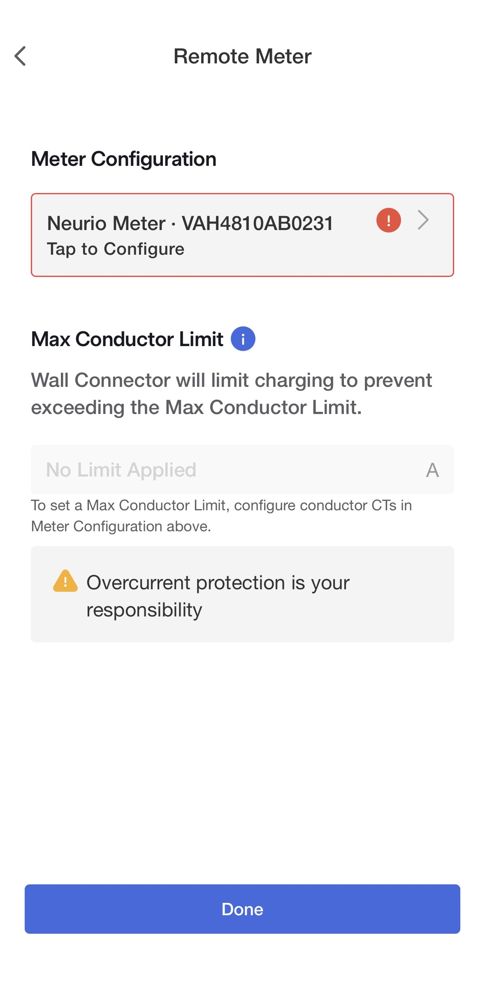
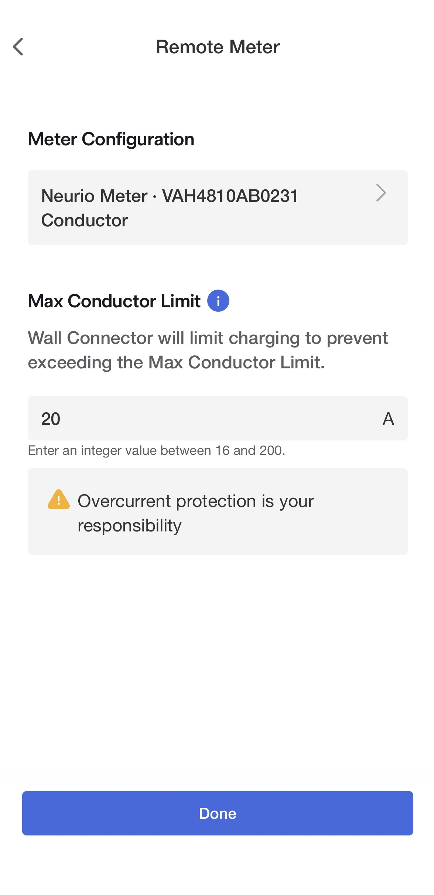

# Tesla Wall Connector Control (Gen 3)

ESPHome configuration to dynamically control a **Tesla Wall Connector Gen 3** by **emulating a Tesla/Neurio energy meter** over **RS485/Modbus**.

The goal is load balancing: the Wall Connector adjusts charge current so your house **main fuse** is not overloaded, based on per-phase current readings from Home Assistant.

## What this does

- Runs on an **ESP32** (ESP-IDF) with an **RS485 transceiver**.
- Acts as a **Modbus server** that the Wall Connector polls (Wall Connector = master).
- Computes an allowed charging current based on:
  - House main fuse rating (A)
  - Number of grid phases (1/2/3)
  - House load per phase (A) from Home Assistant
  - Wall Connector max current (A)
- Updates simulated Neurio values (current/power) so the Wall Connector self-regulates up/down.
- Includes a **watchdog** that can **pause** or limit charging to a safe fallback on sensor/API issues.

## Requirements

- **Tesla Wall Connector Gen 3** (with RS485/Neurio metering enabled/configured in the charger).
- **ESP32** with a free UART + an **RS485 transceiver** (built-in or external).
- Home Assistant + ESPHome (Dashboard/Add-on or CLI).
- Home Assistant sensors that provide **per-phase current in amperes (A)**.

## Sensor requirements (Home Assistant)

You must provide entity_ids for house load **per phase**, in **amperes**:

- ✅ `sensor.<something>_l1_current` in A
- ❌ Not power (W / kW)
- ❌ Not energy (kWh)
- ❌ Not a single “total house current” sensor that aggregates multiple phases (you need per-phase values). In a true 1‑phase installation, the single phase current effectively *is* the total.

Supported setups:
- 1-phase: only Phase 1 sensor required
- 2-phase: Phase 1 + Phase 2 required
- 3-phase: Phase 1 + Phase 2 + Phase 3 required

## Configuration

Most things you need to change are at the top of `tesla-wall-connector-control.yaml` under `substitutions:`:

- `house_phase1_entity`, `house_phase2_entity`, `house_phase3_entity`
- (optional) `tx_pin`, `rx_pin` for your ESP32 wiring
- (optional) watchdog timings

### YAML `substitutions` reference

| Key | What it does |
| --- | --- |
| `device_name` | ESPHome device name (also used for hostname/entity_id prefixes). |
| `friendly_name` | Friendly name shown in Home Assistant. |
| `tx_pin` / `rx_pin` | ESP32 UART pins used for RS485 (connect to RS485 DI/RO). |
| `house_phase1_entity` | Home Assistant entity_id for **Phase 1 current in A** (required). |
| `house_phase2_entity` | Home Assistant entity_id for **Phase 2 current in A** (required for 2-/3-phase). |
| `house_phase3_entity` | Home Assistant entity_id for **Phase 3 current in A** (required for 3-phase). |
| `watchdog_fault_delay_ms` | How long a fault must persist before watchdog takes control. |
| `watchdog_recover_delay_ms` | How long data must be healthy before watchdog releases control back to Auto. |
| `watchdog_freeze_timeout_ms` | How long sensor values can remain unchanged (combined with API staleness) before “frozen” is assumed. |
| `watchdog_api_timeout_ms` | How long without HA updates before an API timeout fault is assumed. |
| `watchdog_boot_grace_ms` | Grace period after boot before watchdog is allowed to act. |

You also need these `!secret` values for ESPHome/Home Assistant:

- `wifi_ssid`, `wifi_password`
- `api_key`
- `ota_pw`
- `fallback_password`

Important: `!secret` values must exist in ESPHome’s `secrets.yaml`, or you must replace `!secret ...` in `tesla-wall-connector-control.yaml` with hardcoded strings (not recommended).

Example `secrets.yaml` (in your ESPHome config):

```yaml
wifi_ssid: "MyWifi"
wifi_password: "secret"
api_key: "base64-key-from-esphome"
ota_pw: "a-password"
fallback_password: "another-password"
```

## Hardware / wiring (overview)

This project is developed/tested using a **LILYGO T-CAN485** board (https://lilygo.cc/en-us/products/t-can485). You can absolutely use any ESP32 + RS485 setup, but you may need to update pins, power/enable GPIOs, and wiring to match your specific hardware.

This configuration uses:

- UART: `tx_pin` (default `GPIO22`) and `rx_pin` (default `GPIO21`)
  - ESP32 TX → RS485 DI
  - ESP32 RX → RS485 RO
- RS485 A/B → Wall Connector RS485 terminals (labels vary; if nothing happens, swap A/B)
- A single WS2812 status LED on `GPIO4` (optional, but configured)

Note: the YAML also defines three internal GPIO switches to power/enable RS485 hardware (`GPIO16`, `GPIO19`, `GPIO17`). If your hardware does not need these enable lines, you can remove them or hard-wire your RS485 module to power (and adjust the YAML accordingly).

## Setup photos

Below are a few photos from my own Wall Connector setup after wiring the ESP32/RS485 and using this configuration.

### Home Assistant view

<p align="center">
  
</p>

### Wall Connector configuration

<table>
  <tr>
    <td align="center">
      <br>
      <sub>Unconfigured</sub>
    </td>
    <td align="center">
      <br>
      <sub>Configured</sub>
    </td>
    <td align="center">
      <br>
      <sub>Setpoint example (20A)</sub>
    </td>
  </tr>
</table>

### Transformer / RS485 wiring

<table>
  <tr>
    <td align="center">
      <br>
      <sub>1</sub>
    </td>
    <td align="center">
      <br>
      <sub>2</sub>
    </td>
    <td align="center">
      <br>
      <sub>3</sub>
    </td>
  </tr>
  <tr>
    <td align="center">
      <br>
      <sub>4</sub>
    </td>
    <td align="center">
      <br>
      <sub>Configured</sub>
    </td>
    <td></td>
  </tr>
</table>

## Home Assistant controls and sensors

After adding the device to ESPHome/HA you’ll get entities like the ones below (names may vary slightly depending on `friendly_name`).

### Controls (things you can change)

| Entity | Type | What it does |
| --- | --- | --- |
| `Tesla Wall Connector Auto Mode` | switch | Enables/disables dynamic load control. When turning on, it validates that the required phase sensors exist (based on `Grid Phase Count`). |
| `Manual Target Setpoint` | number | Manual charging current target (used when Auto Mode is off). |
| `House Main Fuse` | number | Main fuse rating in A (used as the absolute upper limit for calculations). |
| `Wall Connector Max Current` | number | Maximum current the Wall Connector is allowed to use (hardware/user limit). |
| `Grid Phase Count` | select | Select 1/2/3 phases. Determines which sensors are required and how simulated values are computed. |
| `Grid Voltage` | select | Used for simulated power values (W). Does not change current-limit math (which is based on amperes). |
| `Tesla Watchdog Enable` | switch | Enables/disables watchdog safety logic (only applies in Auto Mode). |
| `Tesla Watchdog Fallback Current` | number | Target current used by watchdog when it has to take control (still clamped to safe headroom and max current). |
| `ESPHome Log Level` | select | Adjusts device log verbosity at runtime. |
| `Auto Status LED` | switch | Enables automatic status LED behavior (polling/watchdog indication). |
| `Manual Control Status LED` | light | WS2812 LED control. If you manually toggle this light, Auto Status LED mode is turned off. |
| `<Device> Restart` | button | Reboots the ESP32. |

### Status and diagnostics (read-only)

| Entity | Type | What it shows |
| --- | --- | --- |
| `House Load Phase 1/2/3` | sensor | Current per phase (A) as received from your Home Assistant sensors. |
| `Tesla Wall Connector Effective Setpoint` | sensor | The actual setpoint served to the Wall Connector (includes a small rounding workaround). |
| `Effective Max Charge Current` | sensor | Mirrors `Wall Connector Max Current` as a sensor for UI visibility. |
| `Tesla Auto Status` | text | High-level Auto/Manual state and missing-sensor messages. |
| `Tesla House Load Sensor Status` | text | Detailed house-load sensor health/status. |
| `Tesla Watchdog Status` | text | Watchdog state (OK / Active with reason / Charging paused / Disabled). |
| `Uptime` / `WiFi Signal` | sensor | Basic device diagnostics. |

### Status LED

When auto LED mode is enabled:

- Green blink: Wall Connector is polling Modbus as expected
- Red: Wall Connector has not polled for >10s
- Blue blink: watchdog is active (charging limited/paused for safety)

## How the calculation works (short)

- Picks the “worst phase” (highest current among L1/L2/L3).
- Headroom = `main_fuse - worst_phase - safety_margin`.
- Setpoint is clamped to:
  - never exceed headroom (floored to avoid rounding up into overload)
  - never exceed `Wall Connector Max Current`
- A small workaround (`-0.01A`) is used so the Tesla UI shows the desired integer.
- Simulated Neurio values are set so the Wall Connector sees a load that enforces the target charging current.

## Watchdog (safety)

The watchdog can take control in Auto mode if, for example:

- Home Assistant API updates go stale
- A required phase sensor becomes unavailable (NaN)
- Sensor values appear frozen

After a fault delay, it activates and applies a safe current:

- primarily `Tesla Watchdog Fallback Current`
- but never above headroom or `Wall Connector Max Current`
- may force a pause (0A) if needed

After a healthy period, it releases control back to normal Auto calculations.

## Quick start

1. Add `tesla-wall-connector-control.yaml` to your ESPHome config (Dashboard or repo).
2. Set `house_phase*_entity` in `substitutions` to your HA sensors (A per phase).
3. In HA, set `Grid Phase Count` to 1/2/3 to match your installation.
4. Flash the ESP32 via ESPHome (USB first time, then OTA).
5. Check logs for “Wall Connector started polling Modbus” when the charger is active.

If you run via CLI locally:

```bash
esphome run tesla-wall-connector-control.yaml
```

## Troubleshooting

- Auto mode won’t enable: check `Tesla Auto Status` and verify your `house_phase*_entity` sensors report amperes (not W/kW).
- Red LED / no Modbus polling: verify RS485 wiring, swap A/B, ensure a common reference/ground where required, and confirm UART pins.
- Watchdog triggers often: increase `watchdog_api_timeout_ms` / `watchdog_freeze_timeout_ms` or ensure HA sensors update regularly.

## Warning

Working on electrical panels and EVSE wiring involves **dangerous voltages**. Follow local regulations and use a qualified electrician when required.

## Acknowledgements

Thanks to the authors of these gists for prior art / reference implementations that informed this project:

- `https://gist.github.com/TooMuchAir/a031566aeb1e6bcd882e7c9a0f6a80a6`
- `https://gist.github.com/LucaTNT/4adf01a7252386559070023612efa117`
